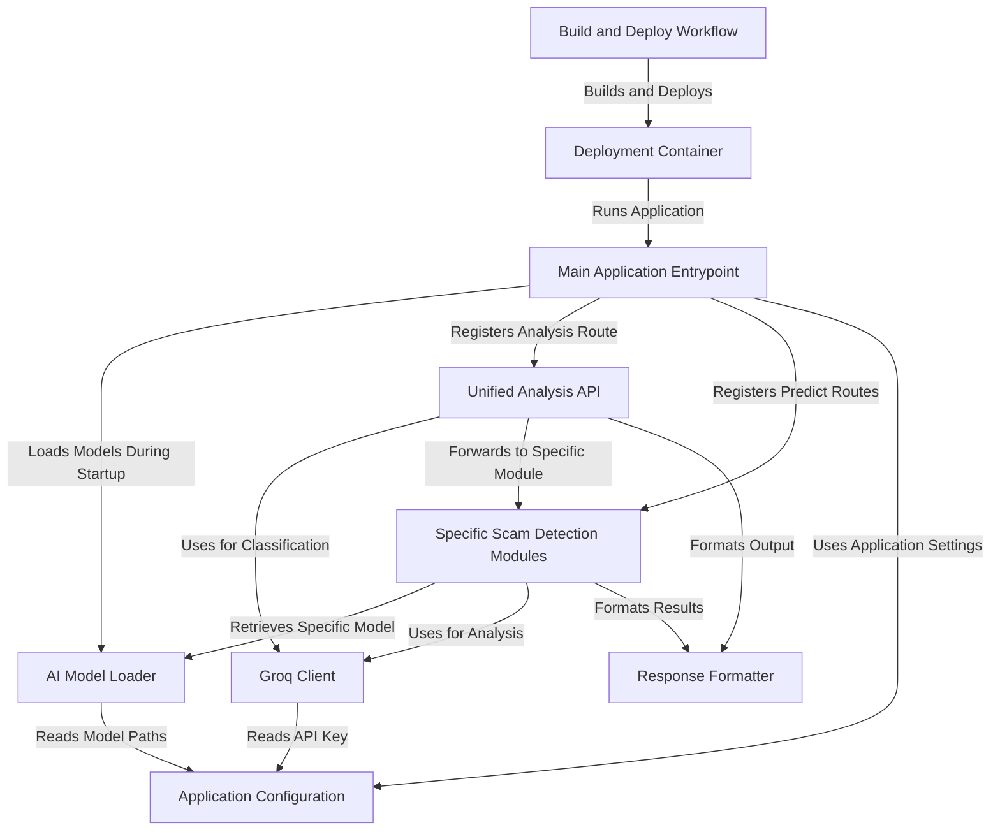
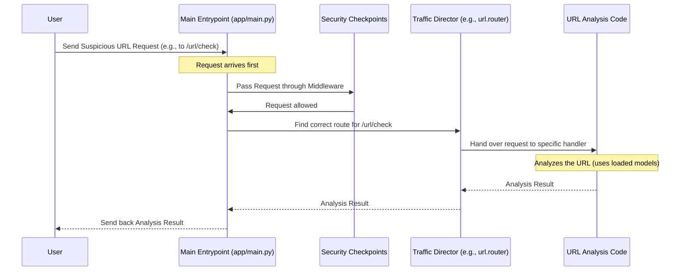
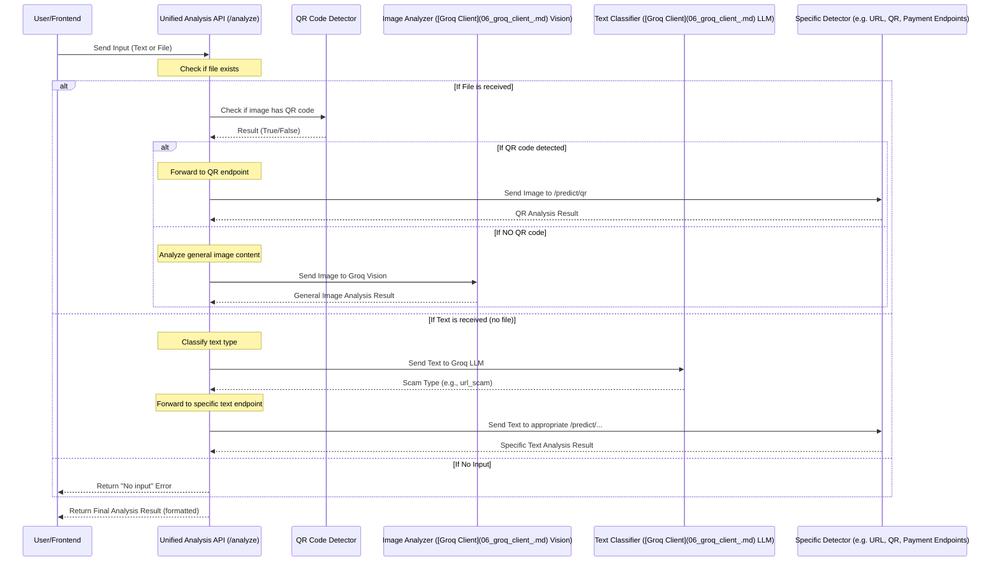

# Tutorial: UPI-SHIELD

This project, *UPI-SHIELD*, is designed to detect various online financial scams.
It acts as a **central hub** for analyzing user input (text or images), using **AI models**
and the **Groq API** to identify risks in things like malicious URLs, QR codes,
payment requests, and investment offers, providing a **clear risk assessment** and explanation.


## Visual Overview



# Chapter 1: Main Application Entrypoint

Welcome to the **UPI-SHIELD** tutorial! We're going to explore how this project helps protect users from scams related to UPI payments. Think of UPI-SHIELD as a smart assistant that can analyze different pieces of information (like URLs, QR codes, etc.) and tell you if they look suspicious.

Before we dive into the cool features, let's understand where it all begins. Every application needs a starting point, a place where it wakes up, gets ready, and waits for instructions. In **UPI-SHIELD**, this starting point is called the **Main Application Entrypoint**.

## What is the Main Application Entrypoint?

Imagine the **UPI-SHIELD** application is like a big building. The main entrypoint is the front door and the reception area. When someone (like a user trying to check a suspicious link) comes to the building, they first arrive here. This area is responsible for:

1.  **Opening Up:** Getting the whole building ready for visitors.
2.  **Setting Rules:** Making sure visitors follow certain security rules before entering specific rooms.
3.  **Directing Visitors:** Guiding each visitor to the correct department or room they need to go to.

In technical terms, the Main Application Entrypoint is where the application is initialized, essential setup happens, and incoming requests are first received and then sent to the right part of the code to be handled.

## Our First Use Case: Checking a Suspicious Link

Let's think about a simple but important task: a user receives a suspicious-looking link (URL) via SMS or WhatsApp and wants to know if it's safe before clicking it.

How does **UPI-SHIELD** help?

1.  The user would somehow give this link to the **UPI-SHIELD** application.
2.  The application needs to receive this link.
3.  It then needs to send the link to the part of the code that knows how to analyze URLs for scams.
4.  Finally, it needs to send the analysis result back to the user.

The Main Application Entrypoint is the very first stop when that suspicious link arrives at **UPI-SHIELD**.

## Inside the Control Center (`app/main.py`)

The heart of our Main Application Entrypoint is a Python file named `main.py` inside the `app` directory. Let's look at some pieces of this file to understand what it does.

```python
# File: app/main.py
from fastapi import FastAPI # We use FastAPI to build our web application
# ... other imports ...

# This is where we create the application!
app = FastAPI(...)
```

This little bit of code does something big: it creates the web application using `FastAPI`. `FastAPI` is a modern, fast web framework for Python that makes building APIs easy. Think of `app = FastAPI()` as constructing our building.

## Getting Ready: The Application Lifespan

Before the application is ready to handle requests, it needs to do some important setup. For **UPI-SHIELD**, a critical setup step is loading the AI models that detect scams. We don't want to load these models every time someone sends a link; we want them ready from the start.

The concept of "lifespan" in `FastAPI` is perfect for this. It defines things that should happen *when the application starts* and *when it shuts down*.

```python
# File: app/main.py
# ... imports ...
from app.core.model_loader import model_loader # We'll learn about this later!

@asynccontextmanager
async def lifespan(app: FastAPI):
    print("⚡ Preloading ML models...")
    model_loader.load_all()  # Load all models during startup
    print("✅ Models preloaded")
    yield
    # Code after yield runs when the application shuts down
    # model_loader.models.clear() # Example: clear models on shutdown (optional)

# Now we tell FastAPI to use this lifespan function
app = FastAPI(lifespan=lifespan)
```

Here, the `lifespan` function is like the building manager getting everything ready before opening.

*   `print(...)` statements show us what's happening when the app starts.
*   `model_loader.load_all()` is the crucial part. This calls another part of our application (the [AI Model Loader](05_ai_model_loader_.md), which we'll discuss in a future chapter) to load all the necessary scam detection models into memory. This makes the analysis much faster when a request arrives.
*   The `yield` keyword separates the startup code from the shutdown code. Everything *before* `yield` runs on startup, and everything *after* `yield* runs on shutdown.

## Adding Security: Middleware

Our application needs some security layers. For example, if we want the API to be usable by a website running on a different address, we need to configure something called CORS (Cross-Origin Resource Sharing). This is handled by **middleware**.

Middleware is like a security checkpoint visitors pass through *before* they reach their final destination inside the building.

```python
# File: app/main.py
# ... imports and FastAPI app creation ...
from fastapi.middleware.cors import CORSMiddleware

app.add_middleware(
    CORSMiddleware,
    allow_origins=["*"], # Allows requests from ANY origin (website)
    allow_methods=["*"], # Allows ANY HTTP method (GET, POST, etc.)
    allow_headers=["*"], # Allows ANY headers
)
```

This code adds the `CORSMiddleware`. For simplicity in this project, we've set it to allow requests from anywhere (`allow_origins=["*"]`). In a real-world production application, you would typically list only the specific websites that are allowed to talk to your API.

## Directing Traffic: Including Routers

Once a request passes through any middleware, the Main Application Entrypoint needs to figure out *where* in the application code that request should go. This is done using **routers**.

Think of routers as the directories and signs inside the building that guide visitors to the right departments (like the "URL Analysis Department" or the "QR Code Checking Office").

```python
# File: app/main.py
# ... imports and middleware setup ...

# Include all routers
app.include_router(analyze.router)
app.include_router(main.router)
app.include_router(url.router)
app.include_router(qr.router)
app.include_router(payment.router)
app.include_router(investment.router)
```

Each `include_router()` line connects a different set of paths (like `/analyze`, `/url`, `/qr`, etc.) to the main application. When a request comes in for `/url`, the Main Entrypoint knows to send it to the code defined in `url.router`.

These routers lead to different parts of the application:
*   `analyze.router` might handle general analysis requests (explained in [Unified Analysis API](03_unified_analysis_api_.md)).
*   `url.router` handles requests specifically for checking URLs.
*   Other routers handle requests for different types of input (QR codes, payment details, investment schemes), which are part of the [Specific Scam Detection Modules](04_specific_scam_detection_modules_.md).

## How it Works: A Request's Journey

Let's trace the journey of our example use case: a user submitting a suspicious URL.



As you can see, the request first hits the Main Entrypoint (`app/main.py`), goes through any configured Middleware, is then directed by the Router to the correct piece of code (`URL_Handler` in this case), and finally the response travels back the same way.

## Starting the Application

The `main.py` file defines *how* the application works, but something needs to actually *run* this file and make it accessible over the internet. In production environments, this is often done using a web server gateway interface (WSGI) or asynchronous server gateway interface (ASGI) server like `uvicorn` or `gunicorn`.

Our project uses a simple shell script `startup.sh` to launch the application:

```bash
#!/bin/bash
exec gunicorn app.main:app \
  --workers 2 \
  --worker-class uvicorn.workers.UvicornWorker \
  --bind 0.0.0.0:${PORT:-8000}
```

This script tells `gunicorn` (an application server) to run the `app` object that is defined inside the `app.main` module (which is our `app/main.py` file). It also configures it to listen on a specific port (like 8000). So, `startup.sh` is the command that actually *starts* our **UPI-SHIELD** building and opens its doors to the public!

## Conclusion

The Main Application Entrypoint, primarily defined in `app/main.py`, is the cornerstone of the **UPI-SHIELD** project. It's responsible for:

*   Initializing the FastAPI application.
*   Managing the application's lifecycle, including loading AI models on startup.
*   Adding essential middleware for security and functionality.
*   Connecting and routing incoming requests to the appropriate handlers.

Understanding this entrypoint gives you a foundational view of how the application receives and begins processing any request, setting the stage for the scam detection logic.

In the next chapter, we'll look at another crucial foundational piece: [Application Configuration](02_application_configuration_.md). This is where all the settings, like database connections or API keys, are managed.

[Next Chapter: Application Configuration](02_application_configuration_.md)

---

<sub><sup>Generated by [AI Codebase Knowledge Builder](https://github.com/The-Pocket/Tutorial-Codebase-Knowledge).</sup></sub> <sub><sup>**References**: [[1]](https://github.com/nirwan-teji/UPI-SHIELD/blob/28029fc6330e2589d3065bf0589a95a64a828337/app/main.py), [[2]](https://github.com/nirwan-teji/UPI-SHIELD/blob/28029fc6330e2589d3065bf0589a95a64a828337/startup.sh)</sup></sub>

# Chapter 2: Application Configuration

Welcome back to the **UPI-SHIELD** tutorial! In [Chapter 1: Main Application Entrypoint](01_main_application_entrypoint_.md), we saw where our application starts and how it gets the initial setup done, like loading the scam detection models. We learned that the `app/main.py` file acts like the front door and reception area of our application building.

But for any building to function, it needs a set of instructions, a blueprint, or a manual. Where are the emergency exits? What's the security code for certain rooms? Where are the important tools kept?

In the world of software, this "manual" is called **Application Configuration**.

## What is Application Configuration?

Think of Application Configuration as the central control panel or the blueprint for the entire **UPI-SHIELD** application. It's where we store all the essential information the application needs to run correctly. This includes things like:

*   **API Keys:** Secret codes needed to talk to external services (like the Groq AI service we'll use).
*   **Network Ports:** The specific "door number" on the internet where the application listens for incoming requests.
*   **File Paths:** The exact locations on the computer's file system where crucial files, like our trained machine learning models, are stored.
*   **Thresholds:** Numbers that define what level of suspicion counts as a "scam" versus just "suspicious."

Why have a central place for all this?

*   **Flexibility:** We can change a setting (like the API key or model path) without changing the core logic of how the application works.
*   **Security:** We can keep sensitive information like API keys separate from the main code.
*   **Organization:** All settings are in one place, making it easier to understand and manage the application's behavior.

## Our Use Case: Finding the AI Models and Groq API Key

Remember how in Chapter 1, the `lifespan` function in `app/main.py` told the [AI Model Loader](05_ai_model_loader_.md) to load models? And we'll later see how the [Groq Client](06_groq_client_.md) talks to an external AI service?

Both of these actions require specific pieces of information:

*   The [AI Model Loader](05_ai_model_loader_.md) needs to know the *exact file paths* to where the trained models are saved on the server.
*   The [Groq Client](06_groq_client_.md) needs the *secret API key* to authenticate with the Groq service.

This is where Application Configuration comes in! It provides these critical pieces of information to the parts of the application that need them.

## Inside the Blueprint Room (`app/config.py`)

In **UPI-SHIELD**, all this configuration information is primarily stored and managed in a file called `config.py` inside the `app` directory.

Let's look at simplified parts of `app/config.py`:

```python
# File: app/config.py
import os
from pathlib import Path
from dotenv import load_dotenv # Helps load settings from a .env file

# Load environment variables from a .env file if it exists
load_dotenv() 

# Base directory of the project
BASE_DIR = Path(__file__).resolve().parent.parent 
```

*   `import os`: This lets us read environment variables from the operating system.
*   `from pathlib import Path`: This is a great way to handle file paths in Python, making them work correctly on different operating systems (Windows, Linux, etc.).
*   `from dotenv import load_dotenv`: This imports a helpful function. `load_dotenv()` looks for a file named `.env` in the project and loads any `KEY=VALUE` pairs found there into the environment variables. This is a common way to keep sensitive information (like API keys) out of the main code files.

## Storing General Settings (`Settings` Class)

Inside `config.py`, we define Python classes to organize different types of settings. One class holds general application settings:

```python
# File: app/config.py (continued)
# ... imports and load_dotenv ...

class Settings:
    # Get Groq API key from environment variable
    GROQ_API_KEY: str = os.getenv("GROQ_API_KEY") 
    
    # Get the port to run on, default to 8000
    PORT: int = int(os.getenv("PORT", 8000)) 
    
    # Define thresholds for scam detection results
    SCAM_THRESHOLD: int = 70 
    SUSPICIOUS_THRESHOLD: int = 40

    # Define types of scams recognized (for responses)
    SCAM_TYPES = {
        "url_scam": "URL/Phishing Link Scam",
        # ... other scam types ...
    }

# Create an instance (an object) of the Settings class
settings = Settings() 
```

*   We define a class named `Settings`.
*   Inside the class, we define attributes (like `GROQ_API_KEY`, `PORT`, `SCAM_THRESHOLD`).
*   We use `os.getenv("VARIABLE_NAME")` to read values from environment variables (which `load_dotenv()` might have loaded from a `.env` file). The second argument (like `8000` for `PORT`) is a default value used if the environment variable isn't set.
*   Finally, `settings = Settings()` creates a single object from this blueprint. This `settings` object is what other parts of the application will import and use.

## Storing Model File Paths (`ModelConfig` Class)

Another important type of configuration is the location of our machine learning models. These are also stored in `config.py`, often in a separate class for clarity:

```python
# File: app/config.py (continued)
# ... imports, load_dotenv, Settings class, settings object ...

class ModelConfig:
    # Use the BASE_DIR defined earlier
    BASE_DIR = Path(__file__).resolve().parent.parent 

    # Define paths to specific model files using BASE_DIR
    URL_MODEL_PATH = BASE_DIR / "ml_models/trained_models/finbert_url/finbert_url_model.bin"
    URL_TOKENIZER_PATH = BASE_DIR / "ml_models/trained_models/finbert_url"
    # ... paths for INVESTMENT, QR, PAYMENT models and vocab ...
    PAYMENT_MODEL_PATH = BASE_DIR / "ml_models/trained_models/bilstm_payment_scam_classifier.pt"
    VOCAB_PATH = BASE_DIR / "ml_models/trained_models/bilstm_vocab.pkl"


# Create an instance (an object) of the ModelConfig class
model_config = ModelConfig() 
```

*   We define a `ModelConfig` class.
*   We use `BASE_DIR` (which points to the root of our project) and the `/` operator from `pathlib` to build the full paths to the model files. This makes the paths relative to the project, so it works even if you move the project directory.
*   `model_config = ModelConfig()` creates the object that other parts of the application will use to find model paths.

By separating `Settings` and `ModelConfig` classes (even in the same file), we make it clear which settings are general application parameters and which are specifically about model locations.

## How Other Parts of the App Use Configuration

Now that we have our `settings` and `model_config` objects created in `app/config.py`, any other file in the project that needs this information can simply import them.

Let's see simplified examples:

**1. [Groq Client](06_groq_client_.md) needing the API Key:**

```python
# File: app/core/groq_client.py (simplified)
from groq import Groq
from app.config import settings # Import the settings object

class GroqClient:
    def __init__(self):
        # Access the API key from the imported settings object
        self.client = Groq(api_key=settings.GROQ_API_KEY) 

    # ... rest of the Groq client methods ...
```

The `GroqClient` just needs one line (`from app.config import settings`) to get access to the entire `settings` object, and then it can use `settings.GROQ_API_KEY`.

**2. [AI Model Loader](05_ai_model_loader_.md) needing File Paths:**

```python
# File: app/core/model_loader.py (simplified)
import torch
from transformers import AutoTokenizer, AutoModelForSequenceClassification
from app.config import model_config # Import the model_config object
import pickle

class ModelLoader:
    def __init__(self):
        self.models = {}
        self.tokenizers = {}
        self.vocab = None

    def load_all(self):
        print("🔍 Loading FinBERT URL model...")
        # Access model path from the imported model_config object
        self.models['url'] = AutoModelForSequenceClassification.from_pretrained(
            str(model_config.URL_MODEL_PATH.parent), # Use the path here
            ... 
        )
        self.tokenizers['url'] = AutoTokenizer.from_pretrained(
            str(model_config.URL_TOKENIZER_PATH) # Use the path here
        )

        print("🔍 Loading BiLSTM vocab...")
        with open(model_config.VOCAB_PATH, "rb") as f: # Use the path here
            self.vocab = pickle.load(f)
        # ... loading other models ...
```

Similarly, the `ModelLoader` imports the `model_config` object and uses its attributes (`model_config.URL_MODEL_PATH`, `model_config.VOCAB_PATH`, etc.) to find the model files.

**3. [Main Application Entrypoint](01_main_application_entrypoint_.md) or Dependencies needing general settings:**

```python
# File: app/main.py (simplified)
# ... imports ...
from app.config import settings # Import the settings object
from app.core.model_loader import model_loader # Also imports model_config internally

# The lifespan function loads models using the model_loader
# The model_loader uses model_config internally
@asynccontextmanager
async def lifespan(app: FastAPI):
    print("⚡ Preloading ML models...")
    model_loader.load_all() 
    print("✅ Models preloaded")
    yield

app = FastAPI(lifespan=lifespan)

# Middleware configuration might implicitly use settings (like CORS details),
# or other parts might use settings.PORT or settings.SCAM_THRESHOLD.

# File: app/dependencies.py (simplified)
from fastapi import HTTPException, Depends
from app.config import settings # Import settings

def validate_groq_api_key():
    """Validate that Groq API key is configured"""
    # Check if the API key from settings is valid
    if not settings.GROQ_API_KEY or settings.GROQ_API_KEY == "your_groq_api_key_here":
        raise HTTPException(
            status_code=500,
            detail="Groq API key not configured. Please set GROQ_API_KEY in .env file."
        )
    return True
```

The `main.py` file doesn't directly use many `settings` attributes in the simplified code shown in Chapter 1, but the `lifespan` function calls `model_loader.load_all()`, which *does* use `model_config`. Other parts, like dependencies for validation, directly use `settings.GROQ_API_KEY`.

## How it Works: Getting a Setting

Let's trace what happens when, for example, the [Groq Client](06_groq_client_.md) needs the API key:

```mermaid
sequenceDiagram
    participant GroqClientInit as GroqClient Initialization
    participant ConfigFile as app/config.py
    participant SettingsObject as settings object
    participant Environment as Environment Variables (.env file)

    GroqClientInit->>ConfigFile: Import 'settings' object
    Note over ConfigFile: First time loaded:
    ConfigFile->>Environment: load_dotenv() reads .env
    ConfigFile->>Environment: os.getenv("GROQ_API_KEY")
    Environment-->>ConfigFile: Returns API Key value
    ConfigFile->>SettingsObject: Create Settings() instance with value
    ConfigFile-->>GroqClientInit: Return 'settings' object instance
    GroqClientInit->>SettingsObject: Access settings.GROQ_API_KEY
    SettingsObject-->>GroqClientInit: Return API Key value
    GroqClientInit: Use API Key to create Groq client
```

When the `GroqClient` is being set up, it imports the `settings` object from `app.config`. The very first time `app.config` is imported, it runs its code: `load_dotenv()` loads variables from the `.env` file, and then the `Settings` class is used to create the `settings` object, reading values like `GROQ_API_KEY` from the environment variables set by `load_dotenv()`. Finally, the `GroqClient` can access the `GROQ_API_KEY` attribute on the now-created `settings` object.

## Key Concepts in `app/config.py`

Here's a quick summary of the key ideas in our configuration file:

| Concept         | What it is                                    | Why it's used                                                                 | Example Attribute             |
| :-------------- | :-------------------------------------------- | :---------------------------------------------------------------------------- | :---------------------------- |
| `.env` file     | A simple text file (`.env`) at project root. | To store sensitive (API keys) or environment-specific settings.               | `GROQ_API_KEY=sk-...`         |
| `load_dotenv()` | Function from `python-dotenv` library.      | Reads `.env` file and puts key-value pairs into environment variables.        | N/A (function call)           |
| `os.getenv()`   | Python built-in function.                     | Reads value of an environment variable. Can provide a default if not found.   | `os.getenv("PORT", 8000)`     |
| `pathlib.Path`  | Python standard library.                      | Object-oriented way to handle file paths, works cross-platform.               | `BASE_DIR / "some/file.txt"`  |
| `Settings` Class| Python class definition.                      | Blueprint for general application settings.                                   | `GROQ_API_KEY`, `PORT`        |
| `ModelConfig` Class| Python class definition.                   | Blueprint specifically for file paths related to ML models.                   | `URL_MODEL_PATH`, `VOCAB_PATH`|
| `settings`/`model_config` objects | Instances of the classes.   | The actual objects that other files import and use to access configuration.   | `settings.PORT`, `model_config.URL_MODEL_PATH` |

## Conclusion

Application Configuration, mainly handled in `app/config.py`, provides the essential context and settings for the **UPI-SHIELD** application. It's like the central brain that knows all the important numbers, keys, and locations needed to perform its tasks. By keeping this separate from the main code, we make the application more organized, secure (especially with `.env` files), and easier to modify when settings change.

You now know where the application gets its instructions about things like API keys and where to find the models. In the next chapter, we'll look at the [Unified Analysis API](03_unified_analysis_api_.md), which is the common interface for analyzing *any* type of input (URL, QR, etc.) using these models and external services.

[Next Chapter: Unified Analysis API](03_unified_analysis_api_.md)

---

<sub><sup>Generated by [AI Codebase Knowledge Builder](https://github.com/The-Pocket/Tutorial-Codebase-Knowledge).</sup></sub> <sub><sup>**References**: [[1]](https://github.com/nirwan-teji/UPI-SHIELD/blob/28029fc6330e2589d3065bf0589a95a64a828337/app/config.py), [[2]](https://github.com/nirwan-teji/UPI-SHIELD/blob/28029fc6330e2589d3065bf0589a95a64a828337/app/core/groq_client.py), [[3]](https://github.com/nirwan-teji/UPI-SHIELD/blob/28029fc6330e2589d3065bf0589a95a64a828337/app/core/model_loader.py), [[4]](https://github.com/nirwan-teji/UPI-SHIELD/blob/28029fc6330e2589d3065bf0589a95a64a828337/app/dependencies.py), [[5]](https://github.com/nirwan-teji/UPI-SHIELD/blob/28029fc6330e2589d3065bf0589a95a64a828337/app/main.py)</sup></sub>


# Chapter 3: Unified Analysis API

Welcome back to the **UPI-SHIELD** tutorial! In the previous chapter, [Chapter 2: Application Configuration](02_application_configuration_.md), we learned about the central blueprint of our application – where all the important settings like API keys and model locations are stored. We saw how `app/config.py` acts as the control panel, providing essential information to different parts of the system.

Now that our application knows *how* to find its tools and secrets, let's look at how it decides *which* tool to use for a given problem.

Imagine you have a problem, but you're not sure if it's a leaky pipe (needs a plumber), a broken light switch (needs an electrician), or a pest issue (needs an exterminator). You call a general home services line, and they figure out what kind of problem you have and send the right expert.

In **UPI-SHIELD**, the **Unified Analysis API** plays this role.

## What is the Unified Analysis API?

The **Unified Analysis API** is the single point where *any* request for analysis first arrives. Whether you want to check a suspicious text message, a strange-looking link, or an image you received, you send it *here*.

This API is smart. It doesn't just pass the request along blindly. Instead, it acts like a **smart receptionist** or a **traffic director**:

1.  **Receives Anything:** It accepts different types of input – plain text or an image file.
2.  **Examines Input:** It quickly figures out *what kind* of input it received. Is it just text? Is it an image? If it's an image, does it contain a QR code?
3.  **Directs to Expert:** Based on what it finds, it sends the input to the correct specialized part of the application – the expert handler for URLs, QR codes, payment requests, etc. (these are the [Specific Scam Detection Modules](04_specific_scam_detection_modules_.md) we'll cover later).
4.  **Collects Result:** It waits for the expert's analysis.
5.  **Returns Standard Response:** It takes the result from the expert and formats it into a standard, easy-to-understand response using the [Response Formatter](07_response_formatter_.md) before sending it back to the user.

This makes using the **UPI-SHIELD** API much simpler for someone calling it (like our frontend). They just need to know *one* place to send *any* suspicious item, and the Unified Analysis API handles the rest.

## Our Use Case: Checking Various Inputs via One Endpoint

Let's revisit our scam checking task. A user might receive:

1.  A suspicious link like `http://fake-upi-pay.com/login` (text).
2.  A text message asking for payment: "Send 500 to this number now!" (text).
3.  A screenshot of a QR code (image).
4.  A screenshot of a payment failure message that looks odd (image).

Instead of having separate API endpoints like `/check-url`, `/check-qr`, `/check-text`, the **Unified Analysis API** provides just one: `/analyze`. The user (or the application's frontend) sends the input to `/analyze`, and the API figures out if it's a URL scam, a QR scam, a payment scam, or something else, and uses the right tool.

## How to Use the Unified Analysis API (`/analyze` Endpoint)

The **Unified Analysis API** is exposed as a single endpoint in our application, usually accessible via the `/analyze` path. It's designed to accept either text or a file (typically an image).

You can interact with this endpoint by sending a `POST` request to `/analyze`. The request can contain:

*   A `text` field in the request body (for text-based inputs).
*   A `file` field containing the uploaded file (for image inputs).

Our frontend (the `frontend/static/js/main.js` file) is a good example of how a client uses this endpoint. It prepares a `FormData` object, which is like a container that can hold both text fields and files, and sends it to `/analyze`.

Here's a simplified look at how the frontend sends data:

```javascript
// File: frontend/static/js/main.js (simplified submit handler)

scamForm.addEventListener('submit', async (e) => {
    e.preventDefault();
    const text = queryInput.value.trim(); // Get text from input box
    const file = fileInput.files[0];     // Get file from file input

    const formData = new FormData(); // Create a container for data

    if (file) {
        formData.append('file', file); // Add the file if present
    } else if (text) { // Only add text if no file is present
        formData.append('text', text); // Add the text if present
    } else {
        // Handle case where neither is provided
        return; 
    }

    // Send the data to the /analyze endpoint
    const response = await fetch('/analyze', {
        method: 'POST',
        body: formData // Send the FormData object
    });

    // ... handle the response ...
});
```

This JavaScript code shows that the frontend prepares the input (either `text` or `file`) and sends it to the `/analyze` path. The `/analyze` endpoint on the backend is built to receive these parameters.

**Example API Call (using `curl` for demonstration):**

Checking text:
```bash
curl -X POST -F 'text=Check out this link: http://suspicious-site.cn' http://localhost:8000/analyze
```

Checking an image file:
```bash
curl -X POST -F 'file=@/path/to/your/qrcode.png' http://localhost:8000/analyze
```
*(Replace `/path/to/your/qrcode.png` with the actual path to an image file)*

The expected output will be a JSON response formatted by the [Response Formatter](07_response_formatter_.md), typically including fields like `is_scam`, `label`, `risk_score`, `scam_type`, and `explanation`.

## Inside the Reception Area (`app/api/routes/analyze.py`)

Let's look at the code that implements the Unified Analysis API. This is primarily located in the `app/api/routes/analyze.py` file. Remember the `app.include_router(analyze.router)` line we saw in [Chapter 1: Main Application Entrypoint](01_main_application_entrypoint_.md)? That line connects this file's logic to the `/analyze` path.

The main function here is `unified_analysis`.

```python
# File: app/api/routes/analyze.py (simplified)
from fastapi import APIRouter, Form, UploadFile, File, HTTPException
import httpx
import time # To measure processing time
# ... other imports like cv2, numpy, base64 ...
from typing import Optional # To make parameters optional

router = APIRouter(tags=["Unified Analysis"])

@router.post("/analyze")
async def unified_analysis(
    text: Optional[str] = Form(None),
    file: Optional[UploadFile] = File(None)
):
    start_time = time.time() # Start timing
    try:
        # --- Logic starts here ---
        # 1. Check if a file (image) was provided
        if file and file.filename and file.size > 0:
            print("Received a file.")
            # ... handle file analysis (check for QR, general image analysis) ...
            pass # Placeholder for file handling logic

        # 2. If no file, check if text was provided
        elif text and text.strip():
            print(f"Received text: {text[:50]}...") # Print first 50 chars
            # ... handle text analysis (classify, send to specific endpoint) ...
            pass # Placeholder for text handling logic

        # 3. If neither is provided
        else:
            return ResponseFormatter.format_error_response("No input provided")

        # --- Result formatting happens here (simplified) ---
        # result = ... get analysis result ...
        # return ResponseFormatter.format_response(result) # Using the formatter

    except Exception as e:
        # ... error handling ...
        return ResponseFormatter.format_error_response(str(e))
    finally:
        # ... print processing time ...
        pass

# Note: Helper functions like classify_scam_type, is_qr_code, analyze_image_content
# are defined above this, but the main logic is in unified_analysis
```

*   `@router.post("/analyze")`: This tells FastAPI that the `unified_analysis` function should run when a `POST` request is made to the `/analyze` path.
*   `text: Optional[str] = Form(None)` and `file: Optional[UploadFile] = File(None)`: These define the expected inputs. `Optional` means they might or might not be present. `Form` and `File` indicate where FastAPI should look for these values in the incoming request (Form data).
*   The `if/elif/else` structure is the core decision-making logic: it checks if a `file` was sent, otherwise checks if `text` was sent, and returns an error if neither is there.

## The Decision Flow: From Input to Expert

Let's trace what happens inside the `unified_analysis` function based on the input:



Here's a breakdown of the steps within the `unified_analysis` function, referencing the code snippets:

1.  **Is it a File?**
    ```python
    # File: app/api/routes/analyze.py (inside unified_analysis)
    if file and file.filename and file.size > 0:
        # Yes, it's a file. Let's see what kind.
        # ...
    ```
    If a file is present, the logic proceeds to check the file.

2.  **If File: Is it a QR Code?**
    ```python
    # File: app/api/routes/analyze.py (inside unified_analysis)
    if file and file.filename and file.size > 0:
        # ...
        if await is_qr_code(file): # Call helper to check for QR
            print("QR code detected in image.")
            # Forward the image to the /predict/qr endpoint
            async with httpx.AsyncClient(timeout=60) as client:
                response = await client.post(
                    "http://localhost:8000/predict/qr", # URL for QR analysis
                    files={"file": (file.filename, await file.read())}
                )
            qr_result = response.json()
            return ResponseFormatter.format_response(qr_result)
        # ...
    ```
    The `is_qr_code` helper function uses the `opencv-python` library (`cv2`) to scan the image for a QR code. If a QR code is found, the *original* image file is sent via `httpx.AsyncClient` to the dedicated QR analysis endpoint (`/predict/qr`), which is part of the [Specific Scam Detection Modules](04_specific_scam_detection_modules_.md).

3.  **If File: Is it a General Image Scam?**
    ```python
    # File: app/api/routes/analyze.py (inside unified_analysis)
    if file and file.filename and file.size > 0:
        # ...
        elif await is_qr_code(file): # (This was the previous block)
            # ... handle QR ...
            pass
        else: # No QR code detected
            print("No QR code detected. Analyzing image content.")
            # Use Groq Vision for general image analysis
            groq_result = await analyze_image_content(file) # Uses Groq Client
            return ResponseFormatter.format_response({
                "is_scam": groq_result.get("label", "").upper() == "SCAM",
                # ... format other fields from Groq result ...
            })
    ```
    If the image *doesn't* contain a QR code, the `analyze_image_content` function is called. This function uses the [Groq Client](06_groq_client_.md) to send the image to an AI model capable of understanding images (vision model) and get a general analysis result. The result is then formatted.

4.  **If No File: Is it Text?**
    ```python
    # File: app/api/routes/analyze.py (inside unified_analysis)
    # ... handle file logic ...

    # Handle text input
    elif text and text.strip():
        print(f"Received text: {text[:50]}...")
        # Classify scam type using AI
        scam_type = await classify_scam_type(text) # Uses Groq Client LLM
        print(f"Classified as: {scam_type}")

        endpoints = {
            "url_scam": "/predict/url",
            "payment_request": "/predict/payment",
            "investment_scam": "/predict/investment"
            # Note: qr_scam is handled by the file path
        }

        if scam_type not in endpoints:
             # Handle unsupported or unclear classification
             pass # Return error or default analysis

        # Forward text to the endpoint based on classification
        async with httpx.AsyncClient(timeout=60) as client:
            response = await client.post(
                f"http://localhost:8000{endpoints[scam_type]}",
                json={"text": text} # Send text as JSON
            )
        return response.json() # Return the result from the specific endpoint
    # ... handle no input else case ...
    ```
    If no file was provided, the logic checks if text was provided. If so, it calls the `classify_scam_type` helper function. This function uses the [Groq Client](06_groq_client_.md) to ask a large language model (LLM) to determine *what kind* of scam the text is related to (URL, payment request, investment). Based on the LLM's classification (`scam_type`), the *original* text is then forwarded using `httpx.AsyncClient` to the appropriate text-based analysis endpoint (like `/predict/url`, `/predict/payment`, or `/predict/investment`), which are part of the [Specific Scam Detection Modules](04_specific_scam_detection_modules_.md).

5.  **Format Response:** In all successful analysis paths, the result from the specific handler or the general image analysis is passed to `ResponseFormatter.format_response()`. While not fully shown in the simplified snippets above, the actual code uses the [Response Formatter](07_response_formatter_.md) to ensure the output is consistent regardless of whether the input was text, a QR code, or a general image.

## Summary of Routing

| Input Type        | Initial Check               | How it's Handled Internally                               | Expert Module Called                                                                 |
| :---------------- | :-------------------------- | :-------------------------------------------------------- | :----------------------------------------------------------------------------------- |
| **File (Image)**  | `is_qr_code(file)`          | If True: Forward image to `/predict/qr` endpoint.         | [Specific Scam Detection Modules](04_specific_scam_detection_modules_.md) (QR)       |
|                   |                             | If False: Send image to [Groq Client](06_groq_client_.md) (Vision API) for general analysis. | [Groq Client](06_groq_client_.md) (Vision)                                           |
| **Text**          | `classify_scam_type(text)`  | Use [Groq Client](06_groq_client_.md) (LLM) to classify text type (URL, Payment, Investment). | [Groq Client](06_groq_client_.md) (LLM) for classification step.                     |
|                   |                             | Forward text to the appropriate `/predict/...` endpoint based on classification. | [Specific Scam Detection Modules](04_specific_scam_detection_modules_.md) (URL, Payment, Investment) |
| **No Input**      | Check if `text` or `file`   | Return an error message.                                  | N/A                                                                                  |

## Conclusion

The **Unified Analysis API** (`/analyze` endpoint) is the smart front desk of **UPI-SHIELD**. It provides a single, convenient entry point for users or client applications to submit potentially suspicious content. By intelligently inspecting the input (text, image, QR code) and routing it to the appropriate specialized detection logic ([Specific Scam Detection Modules](04_specific_scam_detection_modules_.md) or general AI analysis via [Groq Client](06_groq_client_.md)), it simplifies the interaction and ensures the correct tools are used for each analysis task. The result is then standardized by the [Response Formatter](07_response_formatter_.md) before being returned.

You now understand how requests first enter the system and are directed to the right place. Next, we'll dive deeper into those "right places" – the specialized expert modules that perform the actual scam detection for URLs, QR codes, payments, and investments.

[Next Chapter: Specific Scam Detection Modules](04_specific_scam_detection_modules_.md)

---

<sub><sup>Generated by [AI Codebase Knowledge Builder](https://github.com/The-Pocket/Tutorial-Codebase-Knowledge).</sup></sub> <sub><sup>**References**: [[1]](https://github.com/nirwan-teji/UPI-SHIELD/blob/28029fc6330e2589d3065bf0589a95a64a828337/app/api/routes/analyze.py), [[2]](https://github.com/nirwan-teji/UPI-SHIELD/blob/28029fc6330e2589d3065bf0589a95a64a828337/frontend/static/js/main.js


# Chapter 4: Specific Scam Detection Modules

Welcome back to the **UPI-SHIELD** tutorial! In the last chapter, [Chapter 3: Unified Analysis API](03_unified_analysis_api_.md), we learned how the `/analyze` endpoint acts as a smart receptionist, receiving any suspicious input (text or image) and deciding which expert department needs to handle it.

Now, let's step inside those expert departments! These are the **Specific Scam Detection Modules**.

## What are Specific Scam Detection Modules?

Imagine **UPI-SHIELD** is like a security company with different specialists. You don't ask a general security guard to analyze a complex chemical sample; you send it to the chemical analysis lab. Similarly, you wouldn't ask the expert on identifying fake QR codes to analyze a suspicious investment brochure.

The **Specific Scam Detection Modules** are these specialist labs or expert departments within **UPI-SHIELD**. Each module focuses on detecting *one specific type* of scam. They are designed to be experts in their narrow field:

*   One module knows everything about detecting scam **URLs**.
*   Another is dedicated to analyzing **QR codes**.
*   A third specializes in identifying fake **payment requests**.
*   And yet another is skilled at spotting fraudulent **investment offers**.

Why have specialized modules?

*   **Expertise:** Each type of scam has unique patterns and requires different analysis techniques and different AI models. URLs look different from payment requests, which look different from QR codes.
*   **Efficiency:** A module can be highly optimized for its specific task.
*   **Maintainability:** If you need to improve how URL scams are detected, you only need to work on the URL module without affecting the others.

These modules contain the specific logic and use the appropriate tools (like particular AI models loaded by the [AI Model Loader](05_ai_model_loader_.md) or external AI services via the [Groq Client](06_groq_client_.md)) to analyze the input relevant to their expertise.

## Our Use Case: Analyzing Specific Scam Types

Let's think about how the **Unified Analysis API** uses these modules. When a user submits input to the `/analyze` endpoint:

*   If it detects a QR code in an image, the **Unified API** sends that image (or the decoded QR content) to the **QR Scam Detection Module**.
*   If it determines the text is likely a URL scam, it sends the text (the URL) to the **URL Scam Detection Module**.
*   If the text looks like a payment request, it goes to the **Payment Scam Detection Module**.
*   If the text looks like an investment offer, it goes to the **Investment Scam Detection Module**.

Each specific module then takes the input it receives and runs its specialized analysis process.

## Inside the Expert Labs (`app/api/routes/*.py`)

The code for these specific scam detection modules is mainly located in the `app/api/routes/` directory. Remember from [Chapter 1: Main Application Entrypoint](01_main_application_entrypoint_.md) that files like `app/api/routes/url.py`, `app/api/routes/qr.py`, `app/api/routes/payment.py`, and `app/api/routes/investment.py` were included as routers? These files contain the endpoints and logic for each specific module.

For example, `app/api/routes/url.py` handles the `/predict/url` endpoint, `app/api/routes/qr.py` handles `/predict/qr`, and so on. The **Unified Analysis API** sends requests to these `/predict/*` endpoints after deciding the scam type.

Let's look at the core idea within each module. Each module's main task, when called, is to:

1.  Receive the specific input (URL string, image file, etc.).
2.  Get the necessary AI models or tools (using the [AI Model Loader](05_ai_model_loader_.md) or [Groq Client](06_groq_client_.md)).
3.  Perform its specific analysis.
4.  Determine a result (is it a scam? how risky?).
5.  Return the analysis result (which the caller, like the [Unified Analysis API](03_unified_analysis_api_.md), will format using the [Response Formatter](07_response_formatter_.md)).

## Example: The URL Scam Detection Module (`app/api/routes/url.py`)

Let's see how the URL module (`app/api/routes/url.py`) works when it receives a URL from the [Unified Analysis API](03_unified_analysis_api_.md). Its main job is handled by a function connected to the `/predict/url` endpoint.

```python
# File: app/api/routes/url.py (Simplified Core Logic)
from app.core.model_loader import model_loader # Need models
from app.core.groq_client import GroqClient   # Need Groq
# ... other imports ...

# This function runs when /predict/url receives a request
async def detect_url_scam(text: str = Body(..., embed=True)):
    try:
        # Step 1: Use the trained ML model
        def model_predict():
            # Get the URL model and tokenizer from the loader
            model = model_loader.get_model('url')
            tokenizer = model_loader.get_tokenizer('url')
            # Process the text (URL)
            inputs = tokenizer(text, return_tensors="pt", truncation=True, max_length=512)
            # Get prediction from the model
            with torch.no_grad():
                outputs = model(**inputs)
                probs = torch.softmax(outputs.logits, dim=1)
                return torch.argmax(probs).item(), probs[0].tolist()

        model_pred, model_probs = await asyncio.to_thread(model_predict)
        is_scam_model = bool(model_pred == 1) # Model says it's a scam if prediction is 1
        model_risk = int(model_probs[model_pred] * 100) # Convert probability to 0-100 risk score

        # Step 2: Use the Groq LLM for additional analysis
        groq_data = await get_groq_analysis(text) # Call a helper function using GroqClient

        # Step 3: Combine results and determine final outcome
        if "error" not in groq_data:
             # Logic to combine model and Groq results...
             # For simplicity, let's say we prefer Groq's label if available
             is_scam_final = groq_data.get("label", "").upper() == "SCAM"
             risk_final = groq_data.get("risk_score", model_risk) # Use Groq risk if present
             explanation_final = groq_data.get("explanation", "Model analysis only.")
             model_verified = (is_scam_model == is_scam_final) # Check if both agreed
             # ... return the final analysis data ...
        else:
             # Fallback if Groq failed, just use the model result
             is_scam_final = is_scam_model
             risk_final = model_risk
             explanation_final = "Model analysis only (Groq failed)."
             model_verified = False # Can't be verified if Groq failed
             # ... return the fallback analysis data ...

    except Exception as e:
        # Handle errors
        # ... return error data ...
    # Note: The actual code formats the return value using ResponseFormatter
    pass # Placeholder for return logic
```

*   `model_loader.get_model('url')` and `model_loader.get_tokenizer('url')`: This is how the module gets its specific tools – the trained URL scam detection model and its associated tokenizer. These were loaded into memory when the application started, thanks to the [AI Model Loader](05_ai_model_loader_.md) (as seen in Chapter 1).
*   `inputs = tokenizer(...)` and `outputs = model(...)`: This is the core of running the AI model's prediction on the input URL.
*   `get_groq_analysis(text)`: This calls another function (defined within the same file, but we won't show its full code here for brevity) that uses the [Groq Client](06_groq_client_.md) to send the URL text to a large language model for a different perspective on its legitimacy.
*   The `if "error" not in groq_data:` block shows that the module tries to combine the result from its local ML model and the analysis from the external Groq service to arrive at a more confident final decision.

## Example: The QR Scam Detection Module (`app/api/routes/qr.py`)

The QR module works slightly differently because it deals with images. It uses a combination of computer vision techniques (like OpenCV) and potentially a specialized image analysis model (like YOLO) or a vision-capable large language model from Groq.

```python
# File: app/api/routes/qr.py (Simplified Core Logic)
import cv2       # Need OpenCV for QR detection
import numpy as np
from app.core.model_loader import model_loader # May need a QR model
from app.core.groq_client import GroqClient   # May need Groq Vision
# ... other imports ...

# This function runs when /predict/qr receives a request (the image file)
async def detect_qr_scam(file: UploadFile = File(...)):
    try:
        contents = await file.read()
        nparr = np.frombuffer(contents, np.uint8)
        img = cv2.imdecode(nparr, cv2.IMREAD_COLOR) # Convert image file to OpenCV format

        # Step 1: Decode the QR code content using OpenCV
        detector = cv2.QRCodeDetector()
        qr_content, points, _ = detector.detectAndDecode(img)

        if not qr_content:
             # If no QR code is found, this module can't do its job
             # ... return an error or specific message ...
             pass # Placeholder

        # Step 2: Optionally use a local model (e.g., YOLO) to check the IMAGE for suspicious patterns
        # Note: The provided code shows a YOLO model check, but simplifies to checking
        # for a specific 'scam' class detection.
        def model_predict_image():
             model = model_loader.get_model('qr') # Get the QR image model
             results = model(img) # Run prediction on the image
             # Check results for detections indicating a scam
             return any(box.cls.item() == 1 for r in results for box in r.boxes)

        is_scam_image_model = await asyncio.to_thread(model_predict_image)
        model_risk = 100 if is_scam_image_model else 0

        # Step 3: Use Groq Vision to analyze the IMAGE and the DECODED CONTENT
        # Needs the file, so we reset the file pointer if it was read
        await file.seek(0)
        groq_data = await analyze_qr_image(file) # Calls helper using Groq Vision

        # Step 4: Combine results
        if "error" not in groq_data:
            is_scam_groq = groq_data.get("label", "").upper() == "SCAM"
            risk_groq = groq_data.get("risk_score", 0)
            explanation = groq_data.get("explanation", "QR code analysis unavailable")

            # Combine results: if either the local model OR Groq says it's a scam, flag it.
            # Use the max risk score.
            is_scam_final = is_scam_image_model or is_scam_groq
            risk_final = max(model_risk, risk_groq)
            model_verified = (is_scam_image_model == is_scam_groq) # Check if both agreed

            # ... return the final analysis data including qr_content ...
        else:
            # Fallback if Groq failed, use only the image model result
            is_scam_final = is_scam_image_model
            risk_final = model_risk
            explanation = "Model analysis only (Groq failed)."
            model_verified = False
            # ... return the fallback data including qr_content ...

    except Exception as e:
        # Handle errors
        # ... return error data ...
    # Note: The actual code formats the return value using ResponseFormatter
    pass # Placeholder for return logic
```

This module demonstrates how different tools are used: OpenCV for decoding the QR content itself, potentially a local ML model for image analysis, and the [Groq Client](06_groq_client_.md) for a vision-based understanding and analysis of the *content* extracted from the QR code.

## Other Modules (Payment & Investment)

The Payment and Investment scam detection modules (`app/api/routes/payment.py` and `app/api/routes/investment.py`) are similar to the URL module in that they primarily analyze text. They use different specialized local AI models and different prompts when calling the [Groq Client](06_groq_client_.md) to get analysis specific to payment requests or investment offers.

*   **Payment Module:** Uses a local model (like a BiLSTM model for text classification) and asks Groq to analyze the text specifically as a payment request.
*   **Investment Module:** Uses a local model (like a fine-tuned transformer model) and asks Groq to analyze the text specifically as an investment offer.

In each case, the pattern is the same:
1.  Receive specific input (text).
2.  Get the right local model from [AI Model Loader](05_ai_model_loader_.md).
3.  Run the local model prediction.
4.  Call the [Groq Client](06_groq_client_.md) with a prompt tailored to the specific scam type.
5.  Combine the results from the local model and Groq.
6.  Return the combined analysis.

## How it Works: Request Flow through a Specific Module

Let's visualize the journey of a request once the [Unified Analysis API](03_unified_analysis_api_.md) routes it to a specific module, for example, the URL module:

```mermaid
sequenceDiagram
    participant UnifiedAPI as Unified Analysis API (/analyze)
    participant URLModule as URL Detection Module (/predict/url)
    participant ModelLoader as AI Model Loader
    participant GroqClient as Groq Client

    UnifiedAPI->>URLModule: Send URL (text)
    URLModule->>ModelLoader: Request URL model and tokenizer
    ModelLoader-->>URLModule: Provide model and tokenizer
    URLModule: Run local model prediction on text
    URLModule->>GroqClient: Send text and URL-specific prompt
    GroqClient->>UnifiedAPI: Send request to Groq service (External)
    UnifiedAPI-->>GroqClient: Response from Groq service (External)
    GroqClient-->>URLModule: Provide Groq analysis result
    URLModule: Combine local model result and Groq result
    URLModule-->>UnifiedAPI: Return final analysis result (raw data)
    UnifiedAPI: Format result using Response Formatter
    UnifiedAPI-->>User: Send formatted result
```

This diagram shows how the specific module acts as the orchestrator for its particular analysis task, using both the locally loaded models and the external AI service via the [Groq Client](06_groq_client_.md).

## Summary of Specific Detection Modules

Here's a quick table summarizing the different expert modules:

| Module           | Input Type(s) | Primary Local Tool(s)      | External AI Tool(s) | Endpoint Path      |
| :--------------- | :------------ | :------------------------- | :------------------ | :----------------- |
| **URL Scam**     | Text (URL)    | FinBERT Model, Tokenizer   | Groq LLM            | `/predict/url`     |
| **QR Scam**      | Image (File)  | OpenCV, YOLO Model (Image) | Groq Vision         | `/predict/qr`      |
| **Payment Scam** | Text          | BiLSTM Model, Vocab        | Groq LLM            | `/predict/payment` |
| **Investment**   | Text          | Transformer Model, Tokenizer| Groq LLM            | `/predict/investment`|

*Note: The specific model names (FinBERT, YOLO, BiLSTM, Transformer) refer to the types of models used in the project's implementation. You'll learn how these are loaded in the next chapter.*

## Conclusion

The **Specific Scam Detection Modules** are the workhorses of **UPI-SHIELD**. They are the specialized experts, each equipped with the right AI models (loaded via the [AI Model Loader](05_ai_model_loader_.md)) and the ability to leverage external AI power (via the [Groq Client](06_groq_client_.md)) to analyze their specific type of input (URLs, QR codes, payment requests, or investment offers). By routing requests to these specialized units, the [Unified Analysis API](03_unified_analysis_api_.md) ensures that every suspicious item gets the appropriate expert attention.

You now understand the core structure: the entry point receives requests, configuration guides the application, the Unified API routes requests, and specific modules perform the actual detection. The next logical step is to understand how those crucial AI models get loaded into memory, ready for the modules to use.

[Next Chapter: AI Model Loader](05_ai_model_loader_.md)

---

<sub><sup>Generated by [AI Codebase Knowledge Builder](https://github.com/The-Pocket/Tutorial-Codebase-Knowledge).</sup></sub> <sub><sup>**References**: [[1]](https://github.com/nirwan-teji/UPI-SHIELD/blob/28029fc6330e2589d3065bf0589a95a64a828337/app/api/routes/investment.py), [[2]](https://github.com/nirwan-teji/UPI-SHIELD/blob/28029fc6330e2589d3065bf0589a95a64a828337/app/api/routes/payment.py), [[3]](https://github.com/nirwan-teji/UPI-SHIELD/blob/28029fc6330e2589d3065bf0589a95a64a828337/app/api/routes/qr.py), [[4]](https://github.com/nirwan-teji/UPI-SHIELD/blob/28029fc6330e2589d3065bf0589a95a64a828337/app/api/routes/url.py)</sup></sub>


# Chapter 5: AI Model Loader

Welcome back to the **UPI-SHIELD** tutorial! In the last chapter, [Chapter 4: Specific Scam Detection Modules](04_specific_scam_detection_modules_.md), we explored the expert departments – the specialized modules that know how to detect specific types of scams like suspicious URLs or QR codes. We saw that these modules rely on various tools, including AI models, to do their job.

But where do these AI models come from? Training an AI model takes time, and loading a trained model into a program so it can be used for predictions also takes time and uses computer memory. We don't want each expert module to have to find and load its specific AI "brain" *every single time* it receives a request. That would be very slow!

Imagine our **UPI-SHIELD** building again. The expert departments (the detection modules) need special equipment (the AI models). We wouldn't put this heavy, specialized equipment in a closet and ask the expert to haul it out and set it up every time a case comes in. We want it ready to go in their lab from the moment the building opens.

This is where the **AI Model Loader** comes in.

## What is the AI Model Loader?

The **AI Model Loader** is like the central equipment manager or the library for all the AI models (the system's 'brains'). Its main purpose is to:

1.  **Load Models Once:** When the **UPI-SHIELD** application first starts up (as we saw in [Chapter 1: Main Application Entrypoint](01_main_application_entrypoint_.md) with the `lifespan` function), the Model Loader is called to load *all* the necessary AI models into the application's memory.
2.  **Keep Models Ready:** It holds onto these loaded models, keeping them in memory so they are instantly available whenever any of the [Specific Scam Detection Modules](04_specific_scam_detection_modules_.md) need them.
3.  **Provide Models:** It offers a simple way for other parts of the application (the detection modules) to ask for a specific model (like "give me the URL model" or "give me the payment model").

By loading models just once at startup, the **AI Model Loader** ensures that analyzing incoming requests is fast because the models are already warmed up and waiting.

## Our Use Case: Getting AI Models Ready at Startup

The core use case for the **AI Model Loader** is straightforward: ensure all the AI models needed by the [Specific Scam Detection Modules](04_specific_scam_detection_modules_.md) are loaded and accessible *before* the application starts handling any user requests.

Remember the `lifespan` function in `app/main.py` from Chapter 1?

```python
# File: app/main.py (Simplified lifespan function)
# ... imports ...
from app.core.model_loader import model_loader # Import the model loader instance

@asynccontextmanager
async def lifespan(app: FastAPI):
    print("⚡ Preloading ML models...")
    model_loader.load_all()  # <-- THIS IS THE KEY CALL!
    print("✅ Models preloaded")
    yield # Application is now ready
    # ... shutdown code (optional) ...
```

This `model_loader.load_all()` call is precisely what triggers the **AI Model Loader** to perform its main task of loading models. This happens right at the beginning of the application's life.

## Inside the Model Library (`app/core/model_loader.py`)

The core logic for the **AI Model Loader** is found in the `app/core/model_loader.py` file. Let's look at its structure.

It defines a class `ModelLoader` that manages the models.

```python
# File: app/core/model_loader.py (Simplified Structure)
import torch # For models based on PyTorch
from transformers import AutoTokenizer, AutoModelForSequenceClassification # For Transformer models
from app.config import model_config # Need paths from configuration!
import pickle # For loading simple objects like vocabulary

class ModelLoader:
    def __init__(self):
        # This dictionary will hold our loaded models
        self.models = {}
        # This dictionary will hold tokenizers (needed for text models)
        self.tokenizers = {}
        # This will hold a vocabulary object (for one of the models)
        self.vocab = None

    def load_all(self):
        # This method contains the logic to load all models
        print("--- Starting model loading ---")
        # ... loading logic for different models will go here ...
        print("--- Finished model loading ---")

    def get_model(self, model_type: str):
        # Method to get a specific model by name
        # ... logic to return the model from self.models ...
        pass # Placeholder

    def get_tokenizer(self, model_type: str):
        # Method to get a specific tokenizer
        # ... logic to return the tokenizer from self.tokenizers ...
        pass # Placeholder

    def get_vocab(self):
        # Method to get the vocabulary
        # ... logic to return self.vocab ...
        pass # Placeholder

# Create a single instance of the ModelLoader class
# This instance will be used throughout the application
model_loader = ModelLoader()
```

*   `__init__(self)`: Sets up empty dictionaries (`self.models`, `self.tokenizers`) and a variable (`self.vocab`) to store the models, tokenizers, and vocabulary *after* they are loaded.
*   `load_all(self)`: This is the method called during application startup. It contains the step-by-step instructions for loading each required model.
*   `get_model`, `get_tokenizer`, `get_vocab`: These methods are like the library's checkout counter. Other parts of the code call these when they need a specific tool.
*   `model_loader = ModelLoader()`: This creates a single object from the `ModelLoader` class. This one object will manage *all* the models for the entire application. It's imported and used by `main.py` (for loading) and the specific detection modules (for getting models).

## The `load_all` Method: Loading the Brains

Let's look closer at the `load_all` method. It uses the `model_config` object (loaded from `app/config.py`, as we saw in [Chapter 2: Application Configuration](02_application_configuration_.md)) to find the file paths to the trained models on disk.

```python
# File: app/core/model_loader.py (Simplified load_all method)
# ... imports and class definition ...

    def load_all(self):
        try:
            print("🔍 Loading FinBERT URL model...")
            # Use model_config to find the directory containing the model file
            self.models['url'] = AutoModelForSequenceClassification.from_pretrained(
                str(model_config.URL_MODEL_PATH.parent), # Path to directory
                # ... other parameters like ignore_mismatched_sizes ...
            )
            # Use model_config to find the tokenizer directory
            self.tokenizers['url'] = AutoTokenizer.from_pretrained(
                str(model_config.URL_TOKENIZER_PATH) # Path to directory
            )

            print("🔍 Loading FinBERT Investment model...")
            # Load investment model similarly
            self.models['investment'] = AutoModelForSequenceClassification.from_pretrained(
                 str(model_config.INVESTMENT_MODEL_PATH.parent),
                 # ... parameters ...
            )
            self.tokenizers['investment'] = AutoTokenizer.from_pretrained(
                 str(model_config.INVESTMENT_TOKENIZER_PATH)
            )

            print("🔍 Loading BiLSTM Payment model...")
            # Load BiLSTM model (using torch.load)
            self.models['payment'] = torch.load(
                str(model_config.PAYMENT_MODEL_PATH), # Path to the model file
                map_location=torch.device('cuda' if torch.cuda.is_available() else 'cpu') # Load onto GPU if available
            )

            # Load BiLSTM vocabulary (using pickle)
            print("🔍 Loading BiLSTM vocab...")
            with open(model_config.VOCAB_PATH, "rb") as f: # Path to vocab file
                self.vocab = pickle.load(f)

            print("✅ All models (except YOLO) loaded successfully!")

        except Exception as e:
            # If anything goes wrong during loading, print an error and hints
            raise RuntimeError(f"Model loading failed: {str(e)}\n"
                               "💡 Troubleshooting Tips: ...")
```

*   `model_config.URL_MODEL_PATH.parent`: This gets the directory containing the FinBERT URL model file from our configuration. Transformer models often load from a directory, not just a single file.
*   `AutoModelForSequenceClassification.from_pretrained(...)` and `AutoTokenizer.from_pretrained(...)`: These are standard ways to load pre-trained (or fine-tuned) models and their tokenizers from the `transformers` library.
*   `torch.load(...)`: This is used for loading models saved using PyTorch's `save` function, like the BiLSTM payment model. `map_location` tells PyTorch where to load the model (on the CPU or GPU).
*   `pickle.load(f)`: This loads the vocabulary needed for the BiLSTM model from a file saved using Python's `pickle` library.
*   Each loaded model or tokenizer is stored in the `self.models` or `self.tokenizers` dictionary using a simple key like `'url'`, `'investment'`, or `'payment'`.

**What about the QR (YOLO) model?**

The QR code detection module uses a different type of model (YOLO) which is sometimes loaded a bit differently. To save memory on systems that might not need image analysis constantly, this model is configured for "lazy loading". This means it's *not* loaded during `load_all`, but only the *first time* the `qr` model is requested via `get_model('qr')`.

```python
# File: app/core/model_loader.py (Simplified get_model method)
# ... imports and class definition ...

    def get_model(self, model_type: str):
        # Check if the model is already loaded
        if model_type not in self.models:
            # If not, check if it's the special 'qr' model for lazy loading
            if model_type == 'qr':
                print("🐢 Lazy loading YOLO QR model...")
                # Import YOLO here to avoid needing it if QR isn't used
                from ultralytics import YOLO
                # Load the YOLO model using its specific method
                self.models['qr'] = YOLO(str(model_config.QR_MODEL_PATH))
            else:
                # If it's not loaded and not a lazy-load type, something is wrong
                raise ValueError(f"Model '{model_type}' not found and is not supported for lazy loading.")
        # Return the requested model
        return self.models[model_type]

    # get_tokenizer and get_vocab are simpler, just returning the stored object if available
    def get_tokenizer(self, model_type: str):
        if model_type not in self.tokenizers:
             raise ValueError(f"Tokenizer for '{model_type}' not found. ...")
        return self.tokenizers[model_type]

    def get_vocab(self):
         if self.vocab is None:
             raise ValueError("BiLSTM vocabulary not loaded. ...")
         return self.vocab

# Create the global instance AFTER the class definition
model_loader = ModelLoader()
```

This modified `get_model` shows how the QR (YOLO) model is handled. The first time `model_loader.get_model('qr')` is called, it sees the model isn't in `self.models`, loads it using `YOLO(str(model_config.QR_MODEL_PATH))`, stores it, and then returns it. Subsequent calls will find it already in `self.models`.

## How it Works: Loading Models and Getting Them

Let's visualize the process from application startup to a detection module needing a model:

```mermaid
sequenceDiagram
    participant MainApp as Main Entrypoint (app/main.py)
    participant ModelLoader as AI Model Loader (app/core/model_loader.py)
    participant ConfigFile as app/config.py
    participant FileSystem as Disk Storage (ml_models/*)
    participant SpecificModule as Specific Detection Module (e.g. url.py)

    MainApp->>ModelLoader: Call model_loader.load_all() during lifespan startup
    ModelLoader->>ConfigFile: Access model_config
    ConfigFile-->>ModelLoader: Provide model paths
    ModelLoader->>FileSystem: Read model files (e.g., URL model, Payment model)
    FileSystem-->>ModelLoader: Provide model data
    ModelLoader: Load models into self.models, self.tokenizers, self.vocab
    Note over ModelLoader: Models are now held in memory (except QR/YOLO)
    ModelLoader-->>MainApp: Loading complete
    Note over MainApp: Application is now running, ready for requests
    User->>UnifiedAPI: Send request (e.g., URL)
    UnifiedAPI->>SpecificModule: Route request to URL module
    SpecificModule->>ModelLoader: Call model_loader.get_model('url')
    Note over ModelLoader: URL model is already in self.models
    ModelLoader-->>SpecificModule: Provide loaded URL model
    SpecificModule->>ModelLoader: Call model_loader.get_tokenizer('url')
    Note over ModelLoader: URL tokenizer is already in self.tokenizers
    ModelLoader-->>SpecificModule: Provide loaded URL tokenizer
    SpecificModule: Use model and tokenizer to analyze URL
    SpecificModule-->>UnifiedAPI: Return result
```

This diagram shows that the `load_all` call happens once at the beginning, pulling models from disk into memory using configuration paths. Then, later, when a specific module needs a model, it simply asks the `model_loader` instance, which quickly provides the already-loaded model from memory.

## Summary of Models Loaded

Here's a quick table listing the models managed by the `ModelLoader`:

| Model Type      | File Path (from `ModelConfig`)        | Loading Method                           | Loaded During `load_all()`? | Lazy Loaded (on first `get`)? | Used by Module(s)       |
| :-------------- | :------------------------------------ | :--------------------------------------- | :-------------------------- | :---------------------------- | :---------------------- |
| **URL FinBERT** | `URL_MODEL_PATH`, `URL_TOKENIZER_PATH` | `transformers.from_pretrained`           | Yes                         | No                            | URL Detection (`url.py`)|
| **Invest. FinBERT**| `INVESTMENT_MODEL_PATH`, `INVESTMENT_TOKENIZER_PATH`| `transformers.from_pretrained`   | Yes                         | No                            | Investment Detection (`investment.py`) |
| **Payment BiLSTM**| `PAYMENT_MODEL_PATH`                 | `torch.load`                             | Yes                         | No                            | Payment Detection (`payment.py`) |
| **BiLSTM Vocab**| `VOCAB_PATH`                         | `pickle.load`                            | Yes                         | No                            | Payment Detection (`payment.py`) |
| **QR YOLO**     | `QR_MODEL_PATH`                      | `ultralytics.YOLO(...)`                  | No                          | Yes                           | QR Detection (`qr.py`)  |

## Conclusion

The **AI Model Loader**, implemented in `app/core/model_loader.py`, is a vital component of **UPI-SHIELD**. It acts as the central manager for all the machine learning models needed for scam detection. By loading most models once during application startup (as triggered by the `lifespan` function in [Chapter 1: Main Application Entrypoint](01_main_application_entrypoint_.md)) and providing easy access via `get_model`, `get_tokenizer`, and `get_vocab` methods, it ensures that the [Specific Scam Detection Modules](04_specific_scam_detection_modules_.md) can perform their analyses quickly and efficiently without repeatedly loading models from disk. It also handles specific cases like the lazy loading of the QR/YOLO model.

You now understand how the application's internal AI "brains" are loaded and made available. But some of the analysis relies on powerful *external* AI services, specifically from Groq. In the next chapter, we'll look at the component responsible for talking to those external services: the [Groq Client](06_groq_client_.md).

[Next Chapter: Groq Client](06_groq_client_.md)

---

<sub><sup>Generated by [AI Codebase Knowledge Builder](https://github.com/The-Pocket/Tutorial-Codebase-Knowledge).</sup></sub> <sub><sup>**References**: [[1]](https://github.com/nirwan-teji/UPI-SHIELD/blob/28029fc6330e2589d3065bf0589a95a64a828337/app/config.py), [[2]](https://github.com/nirwan-teji/UPI-SHIELD/blob/28029fc6330e2589d3065bf0589a95a64a828337/app/core/model_loader.py), [[3]](https://github.com/nirwan-teji/UPI-SHIELD/blob/28029fc6330e2589d3065bf0589a95a64a828337/app/main.py)</sup></sub>


# Chapter 6: Groq Client

Welcome back to the **UPI-SHIELD** tutorial! In [Chapter 5: AI Model Loader](05_ai_model_loader_.md), we learned how the application gets its internal AI "brains" – the trained models – ready and available in memory for fast analysis. These local models are great for specific, optimized tasks like recognizing patterns in text or images.

However, sometimes we need more than just pattern recognition. We might need a deeper understanding of the *meaning* of a message, a nuanced analysis of an image's content, or a detailed explanation of *why* something looks suspicious. For these more complex tasks, we can tap into the power of very large, general-purpose AI models hosted externally.

Imagine needing an expert consultant who has read the entire internet and can analyze complex situations. **UPI-SHIELD** uses such an expert: powerful AI models provided by Groq.

## What is the Groq Client?

The **Groq Client** is the part of the **UPI-SHIELD** application that acts as the dedicated communication line to the external Groq AI service. Think of it as:

*   **A Translator:** It takes the data **UPI-SHIELD** wants to analyze (like a suspicious text message or an image) and formats it in a way the Groq AI models understand.
*   **A Phone Line:** It sends the request over the internet to the Groq service.
*   **A Listener:** It waits for and receives the response back from Groq, which contains the AI's analysis.

Its main job is to handle all the technical details of talking to the Groq API so that other parts of our application don't have to worry about it.

## Our Use Case: Asking Groq for Expert Opinion

The [Specific Scam Detection Modules](04_specific_scam_detection_modules_.md) and even the [Unified Analysis API](03_unified_analysis_api_.md) sometimes need this external expert opinion. Here's how they might use the Groq Client:

*   The [Unified Analysis API](03_unified_analysis_api_.md) needs to figure out if a piece of text is likely a URL, payment, or investment scam to route it correctly. A Groq LLM (Large Language Model) is excellent at this kind of classification.
*   The URL, Payment, and Investment modules, after running their local models, might send the text to a Groq LLM to get a second opinion, a risk score, and a detailed explanation.
*   The QR module might send the *image* of the QR code (along with any decoded text) to a Groq Vision model to analyze the visual context for scam indicators.

In all these cases, the module needing help doesn't talk directly to Groq; it asks the **Groq Client** to do it.

## Inside the Phone Booth (`app/core/groq_client.py`)

The code responsible for talking to Groq lives in `app/core/groq_client.py`. This file defines the `GroqClient` class.

Let's look at the core of this class:

```python
# File: app/core/groq_client.py (Simplified)
from groq import Groq # This is the official Groq Python library
from app.config import settings # Need settings for the API key
from typing import List, Dict, Any

class GroqClient:
    def __init__(self):
        # Get the API key from our application settings
        api_key = settings.GROQ_API_KEY
        if not api_key:
             # Raise an error if the key is missing (prevents issues later)
             raise ValueError("GROQ_API_KEY is not set in configuration!")

        # Initialize the Groq client from the library
        # This object handles the connection and API calls
        self.client = Groq(api_key=api_key)

    # ... method to send requests will be here ...
```

*   `from groq import Groq`: Imports the necessary library to talk to the Groq API.
*   `from app.config import settings`: Imports our application's configuration object, which holds the crucial `GROQ_API_KEY`. Remember from [Chapter 2: Application Configuration](02_application_configuration_.md) that this key is loaded from an environment variable, often set in a `.env` file, keeping it secure.
*   `class GroqClient:`: Defines the blueprint for our Groq communication handler.
*   `__init__(self)`: This runs when we create a `GroqClient` object. It retrieves the API key from `settings` and uses it to create an instance of the official `Groq` library client (`self.client`). This `self.client` object is what we'll use to actually make API calls.

## The `generate_response` Method: Sending the Request

The main job of the `GroqClient` is done by the `generate_response` method. Other parts of the application call this method when they want to ask a Groq model something.

```python
# File: app/core/groq_client.py (Simplified generate_response method)
# ... imports and __init__ method ...

    async def generate_response(
        self,
        messages: List[Dict[str, str]], # The conversation history/prompt
        model: str = "meta-llama/llama-4-scout-17b-16e-instruct", # Which model to use
        max_tokens: int = 1024 # Limit the length of the response
    ) -> str:
        """Sends messages to Groq API and returns the text response."""
        try:
            # Use the initialized Groq client object to create a chat completion
            completion = await self.client.chat.completions.create(
                messages=messages, # Pass the messages (prompt)
                model=model,     # Specify the model
                max_tokens=max_tokens, # Set max response length
                temperature=0.7 # Controls randomness (0=predictable, 1=creative)
            )
            # Extract and return the text content from the response
            return completion.choices[0].message.content
        except Exception as e:
            # If anything goes wrong (network error, API issue, etc.)
            print(f"Groq API error: {str(e)}")
            # Re-raise a simpler error for the caller to handle
            raise RuntimeError(f"Groq API call failed: {str(e)}")

# It's common to create a single instance if it's used across the app
# Although in this structure, instances are created within route functions,
# the principle is the same: this class encapsulates the API interaction.
# groq_client = GroqClient() # Example if a singleton was desired
```

*   `async def generate_response(...)`: This defines an asynchronous method, meaning it can wait for the API response without blocking the rest of the application.
*   `messages: List[Dict[str, str]]`: This is the crucial input. It's a list of dictionaries representing the conversation with the AI. This is the standard way to prompt chat-based AI models. A simple request usually has a `system` message (telling the AI its role) and a `user` message (the actual question/input).
*   `model: str = "..."`: Allows specifying which Groq model to use. Different models might be better for text analysis, image analysis, etc. The default here is a powerful multi-modal model.
*   `max_tokens: int = 1024`: Limits how long the AI's response can be.
*   `await self.client.chat.completions.create(...)`: This is the actual call to the Groq API using the `self.client` object created in `__init__`. The `await` keyword pauses the function until the response comes back over the network.
*   `return completion.choices[0].message.content`: The response from the API (`completion`) contains details about the result. We navigate through it to get the actual text generated by the AI.
*   The `try...except` block is important for handling potential errors during the network call or API processing.

## How Other Parts Use the Groq Client

Now, let's see how the [Unified Analysis API](03_unified_analysis_api_.md) or the [Specific Scam Detection Modules](04_specific_scam_detection_modules_.md) use this client.

**Example 1: [Unified Analysis API](03_unified_analysis_api_.md) Classifying Text (`app/api/routes/analyze.py`)**

```python
# File: app/api/routes/analyze.py (Simplified helper function)
# ... imports ...
from app.core.groq_client import GroqClient # Import the Groq Client class

async def classify_scam_type(text: str) -> str:
    """Classify scam type using Groq LLM"""
    # Create an instance of the client
    groq_client = GroqClient() 
    
    # Prepare the messages (prompt) for the LLM
    messages = [
        {
            "role": "system",
            "content": """Classify text into exactly one category:
            - url_scam
            - payment_request
            - investment_scam
            Return ONLY the lowercase category name."""
        },
        {
            "role": "user",
            "content": f"TEXT: {text}"
        }
    ]
    try:
        # Call the generate_response method
        response = await groq_client.generate_response(messages)
        # The response should be just the category name like "url_scam"
        return response.strip().lower()
    except Exception as e:
        # Handle errors from the Groq Client
        raise HTTPException(500, f"Classification failed: {str(e)}")

# This function is then called inside the main unified_analysis endpoint
# ... inside unified_analysis ...
# scam_type = await classify_scam_type(text)
# ... route based on scam_type ...
```

The `classify_scam_type` function creates a `GroqClient`, prepares a specific prompt asking for classification, calls `await groq_client.generate_response(messages)`, and processes the simple text response.

**Example 2: QR Module Analyzing Image (`app/api/routes/qr.py`)**

```python
# File: app/api/routes/qr.py (Simplified helper function)
# ... imports ...
from app.core.groq_client import GroqClient # Import the Groq Client class
# ... other imports like base64 ...

async def analyze_qr_image(file: UploadFile) -> dict:
    """Analyze QR code image using Groq vision model"""
    # Create an instance of the client
    groq_client = GroqClient() 
    
    # Read image data and encode for API
    image_data = await file.read()
    base64_image = base64.b64encode(image_data).decode('utf-8')

    # Prepare messages for a multi-modal model (text + image)
    messages = [{
        "role": "user",
        "content": [
            {"type": "text", "text": "Analyze this QR code image for scam indicators."},
            {
                "type": "image_url",
                "image_url": {
                    "url": f"data:{file.content_type};base64,{base64_image}"
                }
            }
        ]
    }]

    try:
        # Call the generate_response method (using the default multi-modal model)
        response = await groq_client.generate_response(messages, max_tokens=1024)
        # The response is expected to be JSON, so it needs parsing
        return parse_groq_response(response) # Uses a helper function
    except Exception as e:
        print(f"Groq vision analysis failed: {str(e)}")
        return {"error": str(e)}

# This function is then called inside the main detect_qr_scam endpoint
# ... inside detect_qr_scam ...
# groq_data = await analyze_qr_image(file)
# ... process groq_data ...
```

The `analyze_qr_image` function prepares messages containing both text instruction and the base64-encoded image data, calls `await groq_client.generate_response(...)`, and then uses a helper function (`parse_groq_response`, often in `app/core/groq_utils.py`) to extract structured data (like label, risk score, explanation) from the AI's text response which is expected to be in JSON format.

## How it Works: A Groq Request's Journey

Let's visualize the flow when a module needs to use the Groq Client, using the URL module as an example:

```mermaid
sequenceDiagram
    participant URLModule as URL Detection Module (/predict/url)
    participant GroqClientCode as GroqClient Class (app/core/groq_client.py)
    participant GroqInstance as GroqClient Instance
    participant ExternalGroqAPI as External Groq API

    URLModule->>GroqClientCode: Create GroqClient() instance
    Note over GroqClientCode: Gets API key from config
    GroqClientCode-->>URLModule: Returns GroqClient Instance
    URLModule->>GroqInstance: Call generate_response(messages, ...)
    GroqInstance->>ExternalGroqAPI: Send API request (HTTP/S)
    Note over ExternalGroqAPI: Process request with AI model
    ExternalGroqAPI-->>GroqInstance: Send API response (JSON)
    GroqInstance: Extract text from response
    GroqInstance-->>URLModule: Return text response
    URLModule: Parse text response (e.g., using groq_utils)
    URLModule: Combine with local model result
    URLModule-->>UnifiedAPI: Return final analysis
```

This diagram shows that the URL module (or any other caller) first gets an instance of the `GroqClient`. It then calls `generate_response` on that instance, providing the prompt (`messages`). The `GroqClient` instance handles the communication with the *actual external Groq API* over the internet and returns the raw text response from the AI back to the caller. The caller is then responsible for interpreting that raw text response (e.g., parsing JSON).

## Groq Utility Functions (`app/core/groq_utils.py`)

Because Groq's response often needs to be in a specific format (like JSON) for easy processing, there's a small helper file, `app/core/groq_utils.py`, which contains utility functions. The main one is `parse_groq_response`, which tries to reliably extract a JSON object from the AI's text response, even if the AI includes extra text or markdown formatting.

Modules like the URL, Payment, and Investment modules use this helper function after receiving the text response from the `GroqClient.generate_response` call to turn the AI's text into a usable Python dictionary.

```python
# File: app/core/groq_utils.py (Simplified parse_groq_response)
import re
import json
from typing import Dict, Any

def parse_groq_response(response: str) -> Dict[str, Any]:
    """Attempts to extract and parse JSON from Groq response."""
    try:
        # Look for a JSON object within the text
        json_match = re.search(r'({.*?})', response, re.DOTALL)
        if json_match:
            # If found, try to parse it
            return json.loads(json_match.group(0))
            
        # If no clear JSON object, try parsing the whole cleaned response
        clean_response = response.strip().replace('```json', '').replace('```', '')
        return json.loads(clean_response)
    except json.JSONDecodeError as e:
        print(f"JSON Parse Error in Groq response: {e}")
    except Exception as e:
        print(f"Error parsing Groq response: {e}")
    # Return empty dict if parsing fails
    return {} 
```

This `parse_groq_response` function is used by the calling modules (like in `analyze_qr_image` or `get_groq_analysis` helpers) to get the structured data like `label` and `risk_score` from the Groq AI's text output.

## Conclusion

The **Groq Client**, primarily defined in `app/core/groq_client.py`, is the essential bridge connecting **UPI-SHIELD** to powerful external AI models from Groq. It handles the authentication (using the API key from [Application Configuration](02_application_configuration_.md)) and the technical details of sending requests and receiving responses from the Groq API. By providing a simple `generate_response` method, it allows the [Unified Analysis API](03_unified_analysis_api_.md) and the [Specific Scam Detection Modules](04_specific_scam_detection_modules_.md) to easily leverage the capabilities of large language and vision models for classification, detailed analysis, and image understanding, complementing the results from the local models managed by the [AI Model Loader](05_ai_model_loader_.md).

You now understand how the application talks to external AI experts. Once we have the analysis results (whether from local models or Groq), we need to present them clearly and consistently. In the next chapter, we'll look at the [Response Formatter](07_response_formatter_.md), which ensures the final output to the user is always in a standard, easy-to-understand format.

[Next Chapter: Response Formatter](07_response_formatter_.md)

---

<sub><sup>Generated by [AI Codebase Knowledge Builder](https://github.com/The-Pocket/Tutorial-Codebase-Knowledge).</sup></sub> <sub><sup>**References**: [[1]](https://github.com/nirwan-teji/UPI-SHIELD/blob/28029fc6330e2589d3065bf0589a95a64a828337/app/api/routes/analyze.py), [[2]](https://github.com/nirwan-teji/UPI-SHIELD/blob/28029fc6330e2589d3065bf0589a95a64a828337/app/api/routes/investment.py), [[3]](https://github.com/nirwan-teji/UPI-SHIELD/blob/28029fc6330e2589d3065bf0589a95a64a828337/app/api/routes/payment.py), [[4]](https://github.com/nirwan-teji/UPI-SHIELD/blob/28029fc6330e2589d3065bf0589a95a64a828337/app/api/routes/qr.py), [[5]](https://github.com/nirwan-teji/UPI-SHIELD/blob/28029fc6330e2589d3065bf0589a95a64a828337/app/api/routes/url.py), [[6]](https://github.com/nirwan-teji/UPI-SHIELD/blob/28029fc6330e2589d3065bf0589a95a64a828337/app/core/groq_client.py), [[7]](https://github.com/nirwan-teji/UPI-SHIELD/blob/28029fc6330e2589d3065bf0589a95a64a828337/app/core/groq_utils.py)


# Chapter 7: Response Formatter

Welcome back to the **UPI-SHIELD** tutorial! In the last chapter, [Chapter 6: Groq Client](06_groq_client_.md), we saw how the application talks to powerful external AI services like Groq to get expert analysis. We learned that both our local AI models (managed by the [AI Model Loader](05_ai_model_loader_.md)) and the Groq models ([Groq Client](06_groq_client_.md)) provide analysis results to the [Specific Scam Detection Modules](04_specific_scam_detection_modules_.md) and sometimes directly to the [Unified Analysis API](03_unified_analysis_api_.md).

Now, here's a challenge: the results from a local URL model might look different from the results from a Groq LLM analyzing text, and results from a Groq Vision model analyzing an image will be different again! If the part of the application receiving these results (like the frontend website showing the report to the user) has to understand all these different formats, it becomes very complicated.

Imagine receiving reports from different experts, each using their own unique template. Some use bullet points, some use paragraphs, some use tables. To make sense of it all for a final summary, you'd need someone to translate them all into *one standard report format*.

In **UPI-SHIELD**, this task is handled by the **Response Formatter**.

## What is the Response Formatter?

The **Response Formatter** is like the **standard report writing department** of **UPI-SHIELD**. Its main job is to:

1.  **Receive Varied Results:** Take the raw analysis results from any of the detection methods (local models, Groq calls, specific modules).
2.  **Standardize:** Process these varied inputs and structure them into a single, predefined format.
3.  **Ensure Consistency:** Make sure that no matter which module performed the analysis or which AI provided input, the *final output* always looks the same.

This consistent format makes it easy for the [Unified Analysis API](03_unified_analysis_api_.md) to return the result and, more importantly, easy for the frontend or any other system using the **UPI-SHIELD** API to read and display the information reliably.

## Our Use Case: Presenting a Clear and Consistent Scam Report

Consider the frontend website for **UPI-SHIELD**. When a user submits a suspicious item, the frontend displays a result showing:

*   Is it a scam? (Yes/No)
*   How risky is it? (A score out of 100)
*   What type of scam is it? (URL, QR, Payment, etc.)
*   Why is it suspicious? (A simple explanation)

The frontend expects this information in a specific structure (like a JSON object with keys like `is_scam`, `risk_score`, `explanation`). The **Response Formatter**'s job is to take the potentially messy or inconsistent data from the internal analysis and transform it into this exact structure.

For example, a local model might return a probability score (like 0.85), while a Groq response might include text like `"label": "SCAM", "risk_score": 90`. The Response Formatter takes these and produces a standard output like:

```json
{
  "is_scam": true,
  "risk_score": 90,
  "scam_type": "URL Scam",
  "label": "SCAM",
  "explanation": "This link is highly likely to be a phishing site."
}
```

## Inside the Report Department Office (`app/core/response_formatter.py`)

The code that implements the **Response Formatter** is located in the `app/core/response_formatter.py` file. It's a simple class with a couple of methods for formatting.

```python
# File: app/core/response_formatter.py
class ResponseFormatter:
    # This method formats a successful analysis result
    @staticmethod
    def format_response(data: dict):
        # Create a new dictionary with standard keys
        return {
            "is_scam": data.get("is_scam", False), # Default to False if not provided
            "risk_score": int(data.get("risk_score", 0)), # Default to 0 and ensure it's an integer
            "scam_type": data.get("scam_type") or data.get("type_of_scam") or data.get("label", "Unknown"), # Try multiple keys for type
            "label": data.get("label", "LEGITIMATE"), # Default label
            "explanation": data.get("explanation", ""), # Default explanation
            "model_verified": data.get("model_verified", False) # Did local model and Groq agree?
        }

    # This method formats an error message into the standard structure
    @staticmethod
    def format_error_response(error_message: str) -> dict:
        # Return a standard format indicating an error, not a scam
        return {
            "is_scam": False, # Errors are not scams themselves
            "risk_score": 0,  # No risk associated with the error
            "scam_type": "Unknown", # Can't determine scam type on error
            "label": "LEGITIMATE", # Default label for non-scam states
            "explanation": f"Error: {error_message}", # Include the specific error message
            "model_verified": False # No models could verify
        }
```

*   `@staticmethod`: This means you can call these methods directly on the class (`ResponseFormatter.format_response(...)`) without needing to create an object (`formatter = ResponseFormatter()`). It's just a handy way to group related functions.
*   `format_response(data: dict)`: This is the primary method used for successful analyses. It takes a Python dictionary (`data`) as input, which contains the raw results from a detection module.
*   `data.get("key", default_value)`: This is a safe way to get values from the input dictionary. If `"key"` exists in `data`, it returns its value. If not, it returns `default_value`. This prevents errors if an analysis module forgets to include a field.
*   The method constructs and returns a *new* dictionary with a fixed set of keys (`is_scam`, `risk_score`, etc.), ensuring the output structure is always the same.
*   `format_error_response(error_message: str)`: This method is used specifically when an error occurs during analysis (e.g., a model failed to load, an external API call failed). It takes an error message string and formats it into the *same* standard dictionary structure, but with default values indicating a non-scam state and putting the error details in the `explanation`.

## How Other Parts Use the Response Formatter

The [Unified Analysis API](03_unified_analysis_api_.md) and the [Specific Scam Detection Modules](04_specific_scam_detection_modules_.md) are the main users of the **Response Formatter**. They call its methods just before sending the final result back.

Let's look at snippets from the `app/api/routes/` files to see this in action.

**From the URL Module (`app/api/routes/url.py`):**

After performing both local model analysis and Groq analysis, the URL module needs to combine and format the result:

```python
# File: app/api/routes/url.py (Simplified return logic)
# ... after model_predict and get_groq_analysis ...
from app.core.response_formatter import ResponseFormatter # Import the formatter

@router.post("/predict/url")
async def detect_url_scam(...):
    try:
        # ... (perform analysis, get model_risk, groq_data, etc.) ...

        if "error" not in groq_data:
            # We have results from both, combine and format
            combined_result = {
                "is_scam": ..., # Determine final scam decision
                "label": ...,   # Determine final label
                "risk_score": ..., # Determine final risk
                "scam_type": "URL Scam",
                "explanation": groq_data.get("explanation", "Analysis unavailable"),
                "model_verified": (...) # Did models agree?
            }
            # Format the combined result using the formatter
            return ResponseFormatter.format_response(combined_result)
        else:
            # Groq failed, just use the model result and format
            fallback_result = {
                "is_scam": is_scam_model,
                "label": "SCAM" if is_scam_model else "LEGITIMATE",
                "risk_score": model_risk,
                "scam_type": "URL Scam",
                "explanation": "Model analysis only (Groq failed).",
                "model_verified": False
            }
            # Format the fallback result
            return ResponseFormatter.format_response(fallback_result)

    except Exception as e:
        # If any error happened during the process, format an error response
        return ResponseFormatter.format_error_response(str(e))
```

Notice how `ResponseFormatter.format_response()` is called in both successful scenarios (using combined results or fallback results). The raw data structure created *before* formatting might be slightly different (`combined_result` vs `fallback_result`), but `format_response` ensures the dictionary *returned* to the caller always has the same keys and data types. The `format_error_response` is used in the `except` block for standard error reporting.

**From the Unified Analysis API (`app/api/routes/analyze.py`):**

The Unified API also uses the formatter, for example, when handling general image analysis that didn't contain a QR code:

```python
# File: app/api/routes/analyze.py (Simplified image analysis return logic)
# ... after calling analyze_image_content(file) which uses Groq Vision ...
from app.core.response_formatter import ResponseFormatter # Import the formatter

@router.post("/analyze")
async def unified_analysis(...):
    try:
        # ... (handle file upload, check for QR) ...

        if file and file.filename and file.size > 0 and not await is_qr_code(file):
             # It's an image without a QR code, do general image analysis
             file.file.seek(0) # Reset file pointer
             groq_result = await analyze_image_content(file) # Get result from Groq Vision
             
             # Structure the result data
             image_analysis_data = {
                 "is_scam": groq_result.get("label", "").upper() == "SCAM",
                 "label": groq_result.get("label", "UNKNOWN"),
                 "risk_score": groq_result.get("risk_score", 0),
                 "scam_type": "image_scam", # Specific type for this case
                 "explanation": groq_result.get("explanation", "Image analysis failed"),
                 "model_verified": False # No second model to verify against
             }
             # Format the structured data and return
             return ResponseFormatter.format_response(image_analysis_data)

        # ... (handle text input, forwarding, etc.) ...

    except Exception as e:
        # Use the formatter for any top-level errors too
        return ResponseFormatter.format_error_response(str(e))
```

Here, the `unified_analysis` function creates a dictionary `image_analysis_data` based on the Groq Vision output and then passes it to `ResponseFormatter.format_response()` before returning. This ensures that even this specific analysis path returns data in the expected standard format.

## How it Works: The Formatting Step

Let's visualize the final step before a result leaves the server and goes back to the user:

```mermaid
sequenceDiagram
    participant SpecificModule as Specific Detection Module (e.g., url.py)
    participant RawResult as Raw Analysis Result (dict)
    participant ResponseFormatter as Response Formatter
    participant FormattedResult as Standard Formatted Result (dict)
    participant UnifiedAPI as Unified Analysis API (/analyze)
    participant User as User/Frontend

    SpecificModule->>RawResult: Compile raw analysis data (from models, Groq)
    SpecificModule->>ResponseFormatter: Call format_response(RawResult)
    Note over ResponseFormatter: Process raw data,\n apply defaults,\n ensure correct keys
    ResponseFormatter-->>SpecificModule: Return FormattedResult
    SpecificModule-->>UnifiedAPI: Return FormattedResult (often passed through)
    UnifiedAPI: Prepare HTTP response (e.g., JSON) with FormattedResult
    UnifiedAPI-->>User: Send HTTP Response with FormattedResult JSON
```

This shows that the formatter is the crucial last step within the detection logic. It takes whatever intermediate format the module has assembled and converts it into the single, predictable output format that the rest of the system relies on.

## Key Fields in the Standard Response

The standard format produced by the `ResponseFormatter` ensures the following fields are always present:

| Field Name       | Data Type | Description                                                                   | Example Value         |
| :--------------- | :-------- | :---------------------------------------------------------------------------- | :-------------------- |
| `is_scam`        | Boolean   | `true` if the analysis indicates a scam or high risk, `false` otherwise.      | `true`                |
| `risk_score`     | Integer   | A numerical score indicating the level of risk, typically 0-100.              | `90`                  |
| `scam_type`      | String    | The detected category of the input (e.g., "URL Scam", "QR Scam", "image_scam"). | `"URL Scam"`          |
| `label`          | String    | A general classification, usually "SCAM" or "LEGITIMATE".                     | `"SCAM"`              |
| `explanation`    | String    | A human-readable reason or description of the analysis findings.              | `"Suspicious domain"` |
| `model_verified` | Boolean   | Indicates if results from multiple models/sources agreed (if applicable).     | `true`                |

This consistent structure is what the frontend expects, making the display logic much simpler.

## Conclusion

The **Response Formatter**, implemented in `app/core/response_formatter.py`, serves as the crucial final step in the **UPI-SHIELD** analysis pipeline. It takes potentially varied and raw results from the [Specific Scam Detection Modules](04_specific_scam_detection_modules_.md) (which might have used local models from the [AI Model Loader](05_ai_model_loader_.md) and external AI via the [Groq Client](06_groq_client_.md)) and standardizes them into a consistent, easy-to-understand dictionary format. This ensures that the [Unified Analysis API](03_unified_analysis_api_.md) and any client applications can reliably interpret the analysis results.

You now understand how the final report is generated in a predictable format. The analysis is complete, the report is ready – what's next? We need to package the entire application so it can run on a server or in the cloud. In the next chapter, we'll look at the [Deployment Container](08_deployment_container_.md), which helps bundle the application and all its dependencies for easy deployment.

[Next Chapter: Deployment Container](08_deployment_container_.md)

---

<sub><sup>Generated by [AI Codebase Knowledge Builder](https://github.com/The-Pocket/Tutorial-Codebase-Knowledge).</sup></sub> <sub><sup>**References**: [[1]](https://github.com/nirwan-teji/UPI-SHIELD/blob/28029fc6330e2589d3065bf0589a95a64a828337/app/api/routes/analyze.py), [[2]](https://github.com/nirwan-teji/UPI-SHIELD/blob/28029fc6330e2589d3065bf0589a95a64a828337/app/api/routes/investment.py), [[3]](https://github.com/nirwan-teji/UPI-SHIELD/blob/28029fc6330e2589d3065bf0589a95a64a828337/app/api/routes/payment.py), [[4]](https://github.com/nirwan-teji/UPI-SHIELD/blob/28029fc6330e2589d3065bf0589a95a64a828337/app/api/routes/qr.py), [[5]](https://github.com/nirwan-teji/UPI-SHIELD/blob/28029fc6330e2589d3065bf0589a95a64a828337/app/api/routes/url.py), [[6]](https://github.com/nirwan-teji/UPI-SHIELD/blob/28029fc6330e2589d3065bf0589a95a64a828337/app/core/response_formatter.py)
